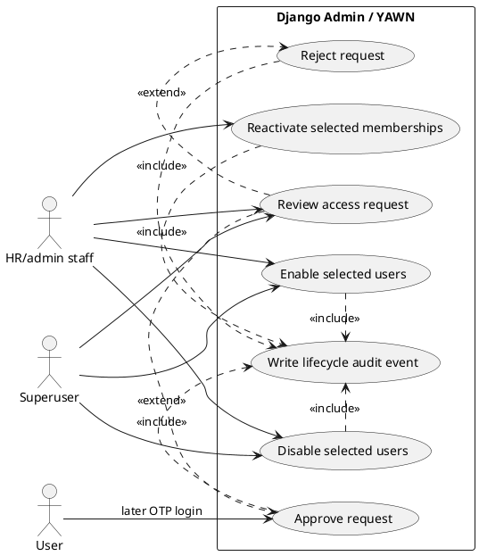

# Admin access and user lifecycle

Django Admin is source of truth for access review and global user suspension. HR/admin members
need staff access and active HR/admin membership; superusers retain full access.

## Actors

- Superuser: unrestricted Django Admin operator.
- HR/admin staff member: active HR/admin membership plus staff access.
- User: person whose request or account changes.
- YAWN audit log: records lifecycle events without email or OTP data.

## Preconditions

- Reviewer is superuser, or has `is_staff=True` and active HR/admin membership in active company.
- Access request targets reviewer's active company.
- Disable/enable is performed through explicit Django Admin action, not direct `is_active` editing.

## Happy paths

### Review access request

1. Reviewer opens `AccessRequest` in Django Admin.
2. Reviewer approves: transaction creates user and employee membership when absent, or reuses an
   already-active membership without changing its role. Existing inactive memberships are skipped:
   request stays pending until **Reactivate selected memberships** is run deliberately. Safe requests
   are still processed. Approval marks request approved and creates audit event. After commit, one plain-text
   approval email directs requester to `WIO_APP_URL` and **Already approved? Sign in**.
3. Or reviewer rejects: request becomes rejected and audit event is written; no email is sent.
4. Approved user completes normal OTP login; approval itself does not create session.

### Disable user

1. Reviewer selects users and chooses **Disable selected users**.
2. Admin sets `User.is_active=False`, preserves memberships and history, and writes
   `accounts.user_disabled` event.
3. Current session fails at next authenticated request. OTP request sends no email; OTP verification
   cannot create session.

### Enable user

1. Reviewer selects users and chooses **Enable selected users**.
2. Admin sets `User.is_active=True`, preserves membership state, and writes
   `accounts.user_enabled` event.
3. If membership is disabled, reviewer opens `Company memberships`, selects it, and chooses
   **Reactivate selected memberships**.
4. HR/admin reviewers can reactivate memberships only in their active managed companies; superusers
   can reactivate any membership.
5. Reactivation sets `CompanyMembership.is_active=True` and writes
   `accounts.membership_reactivated`; it sends no approval email or OTP email.
6. User becomes OTP-eligible only when both user and membership are active.

## Failure paths

- Non-superuser without active staff HR/admin authority cannot see or review access requests.
- Unauthorized Django Admin user cannot run lifecycle actions or edit around auditing.
- Approval for existing disabled user does not re-enable user.
- Approval for an existing inactive membership leaves request pending, preserves membership role and
  state, creates no approval audit event, and sends no email. Admin shows only a count of skipped requests.
- Rejection, repeat approval, disable/enable, direct user creation, and membership reactivation never
  send approval email. Approval-email delivery failure never rolls back approved access and logs no
  recipient or message content.
- Disable/enable does not alter membership history or silently change membership `is_active`.

## Admin actions and audit events

| Admin action | State change | Audit event |
| --- | --- | --- |
| Approve access request | Pending request approved; user/membership created or reused as allowed | Access-request approval event |
| Reject access request | Pending request rejected | Access-request rejection event |
| Disable selected users | `User.is_active=False` | `accounts.user_disabled` |
| Enable selected users | `User.is_active=True` | `accounts.user_enabled` |
| Reactivate selected memberships | `CompanyMembership.is_active=True` in permitted company scope | `accounts.membership_reactivated` |

## Security rules

- Limit review visibility and actions to superusers or active staff HR/admin members.
- Use transaction and row locking for approval to prevent duplicate users or memberships.
- Remove direct `is_active` editing from User admin forms; actions ensure audit coverage.
- Suspension is global. Memberships stay intact for recoverable re-enable.
- HR/admin membership visibility and reactivation actions are restricted to their active managed companies;
  superusers retain global scope.
- Audit metadata excludes email address, OTP, and other secrets.

## Use-case diagram

