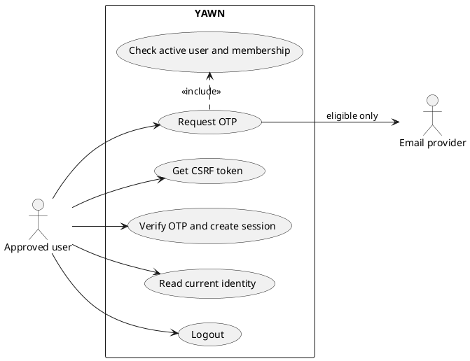

# OTP login, session, and logout

Approved users sign in with a one-time email code. Login creates a Django session only when user,
company, and membership remain active.

## Actors

- Approved user: requests and verifies OTP.
- YAWN API: issues CSRF token, handles OTP, session, and logout.
- Email provider: delivers eligible OTP messages.

## Preconditions

- User has approved access, is active, and has an active membership in active company.
- Browser can retain session and CSRF cookies.
- Frontend has normalized email and retains returned `challenge_id` before verification.

## Happy path

1. Browser calls `GET /api/v1/auth/csrf/` before unsafe credentialed requests.
2. User submits email to `POST /api/v1/auth/otp/request/`.
3. API returns generic `202` with challenge ID; eligible user receives OTP subject to cooldown and limits.
4. User submits email, challenge ID, and six-digit code to `POST /api/v1/auth/otp/verify/` with CSRF proof.
5. API consumes valid unexpired challenge, creates Django session, and writes `auth.otp_login_succeeded` audit event.
6. Frontend calls `GET /api/v1/users/me/` and shows identity and memberships.
7. User calls `POST /api/v1/auth/logout/`; API ends session and writes `auth.logout` audit event.

## Failure paths

- Unknown, unapproved, inactive, disabled, or membership-inactive email gets generic OTP-request response and no email.
- Invalid, expired, consumed, or over-attempt OTP cannot create session.
- Existing disabled user's session fails on next protected request; frontend treats `401` or `403` as signed out.
- Network failure preserves return-to-email/retry state; frontend never assumes session without `/users/me/`.
- Re-enabled user still cannot sign in until active membership exists; enabling user alone does not activate membership.

## API actions

| Action | Endpoint | Expected result |
| --- | --- | --- |
| Obtain CSRF token | `GET /api/v1/auth/csrf/` | Cookie/token for unsafe browser requests. |
| Request OTP | `POST /api/v1/auth/otp/request/` | Generic `202`; no eligibility disclosure. |
| Verify OTP | `POST /api/v1/auth/otp/verify/` | Current-user response and session only after valid eligible challenge. |
| Restore session | `GET /api/v1/users/me/` | Identity/memberships or `401`/`403`. |
| Logout | `POST /api/v1/auth/logout/` | Session ended and logout audit event. |

## Security rules

- OTP request is non-enumerating; only eligible active user with active membership receives mail.
- OTP is one-time, expires, has attempt limit, cooldown, and email/IP request limits.
- OTP verification requires CSRF proof; unsafe credentialed requests use shared `apiFetch` behavior.
- Disabled users cannot receive OTP or create session; live session is invalid at next protected request.
- Never store OTP value in audit events or logs.

## Use-case diagram

