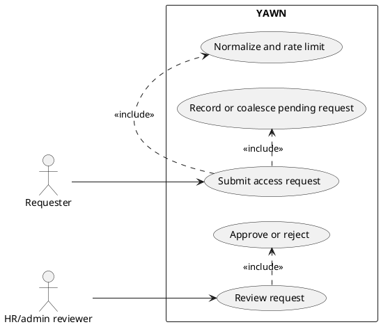

# Access-request sign-up

Public sign-up records a request for access. It does not create an active account, membership,
OTP challenge, or session. An HR/admin reviewer must approve access before normal OTP login can
succeed.

## Actors

- Requester: unauthenticated person asking for company access.
- YAWN API: accepts a non-enumerating request.
- HR/admin reviewer: reviews request through Django Admin.

## Preconditions

- `WIO_SIGNUP_COMPANY_SLUG` identifies an active company.
- Requester supplies a valid email, first name, and last name.
- Signup endpoint is public; no session or CSRF proof is required for its request.

## Happy path

1. Requester submits `email`, `first_name`, and `last_name` to `POST /api/v1/auth/sign-up/`.
2. API normalizes email, derives and hashes requester fingerprint, and applies separate email and
   fingerprint limits.
3. API creates an `AccessRequest` in `pending` state for configured active company, or coalesces
   matching pending request.
4. API returns generic `202 Accepted` confirmation.
5. HR/admin later approves request in Django Admin. After approval commits, YAWN sends one plain-text
   approval notification with `WIO_APP_URL` and **Already approved? Sign in** instructions. Requester
   then uses normal OTP login.

## Failure and edge paths

- Invalid payload returns validation error without creating request.
- Inactive or missing configured company returns generic response and does not create access.
- Duplicate pending request returns same generic `202`; it does not disclose prior request.
- Email or fingerprint limit returns generic `202`; it does not reveal throttling or account state.
- Rejected request remains non-loginable until an authorized reviewer takes a later action.

## API and Admin actions

| Action | Interface | Result |
| --- | --- | --- |
| Submit request | `POST /api/v1/auth/sign-up/` | Generic `202`; pending request only. |
| Review request | Django Admin `AccessRequest` | HR/admin or superuser can approve or reject. |
| Approve | Django Admin action | Reuses or creates user; creates membership only if absent. Existing inactive membership requires separate explicit reactivation, otherwise request remains pending. Safe approval marks approved, writes audit event, then sends one post-commit approval email. |
| Reject | Django Admin action | Marks request rejected and writes audit event. |

## Security rules

- Generic response never reveals account, request, membership, or rate-limit status.
- Email is normalized; requester fingerprint is stored only as a keyed hash.
- Rate limiting is separate for email and fingerprint to reduce targeted and distributed abuse.
- Approval is atomic and never creates session or sends OTP. Email delivery happens after commit;
  delivery failure is generic, safe-logged, and never reverses approval.
- Approval must not silently re-enable a disabled user.
- Approval must not reactivate an inactive membership or alter its role; reactivation is a separate audited Admin action.

## Use-case diagram

